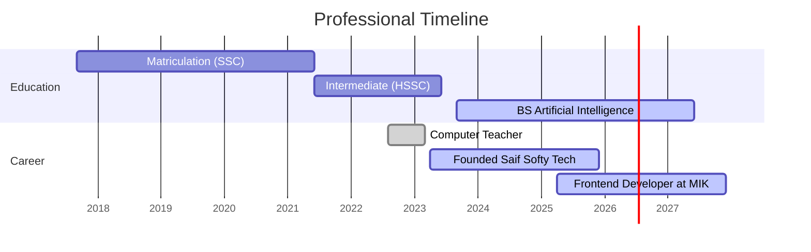

<!-- SEO-Optimized Header -->

  <h1>Ihsan Saif</h1>
  <h3>AI Solutions Architect | Full-Stack Engineer</h3>
  
  

    
    
    
  

---

## 🔬 **Technical Competencies**

| Artificial Intelligence           | Frontend Engineering         | Others        |
|-----------------------------------|------------------------------|-----------------------------|
|  |  |  |
|  |  |  |
|  |  |  |
|  |  |  |
|  |  |  |
| |  |  |
| |  |  |

---

## 📜 **Career Timeline**

🔵 Current ▰▰▰▰ | 🟢 Completed

## 🤝 **Connect Professionally**

 
  
  
  

---

